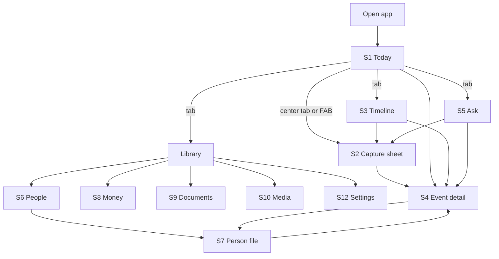
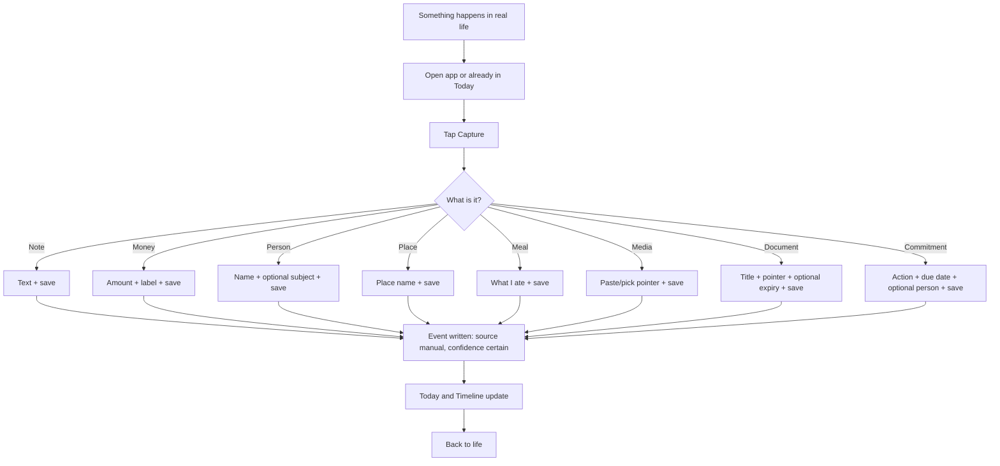
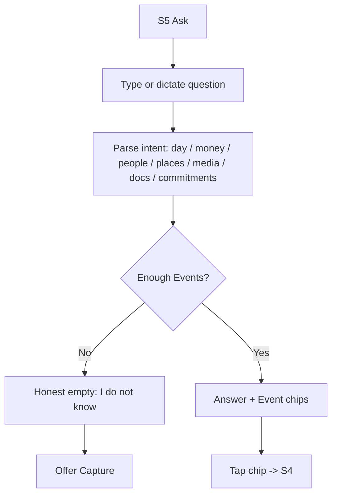
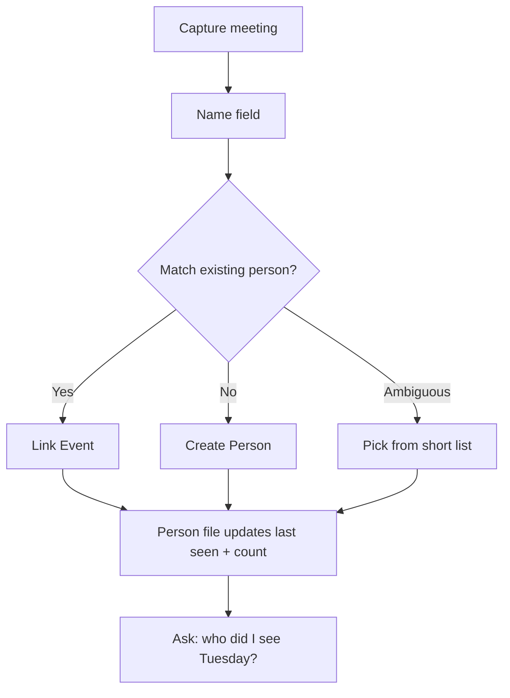
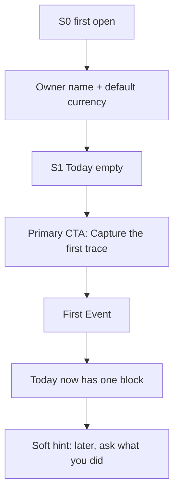

# Mobile user flows — Life Memory Core (V1)

**Feature**: [spec.md](./spec.md)
**Created**: 2026-08-24
**Source vision**: `flow.md` (two expert sketches of a personal life OS)

This file treats the vision as a **mobile product**. It is not V2–V4.
It is the screen-level companion to the spec.

## 1. What we kept vs what we parked

| Vision theme (`flow.md`) | V1 treatment | Later |
|---|---|---|
| Universal timeline of Events | Primary object. Every capture becomes an Event | — |
| Today dashboard | Home tab, data-only recap | — |
| Day replay | Timeline tab + date picker + Ask | Density calendar heatmaps (V2) |
| Ask anything | Ask tab, grounded answers | RAG / embeddings (V2) |
| People files | Library → People | Relationship coaching (V3) |
| Expenses | Capture type + Today money + Ask | Bank / Wave / MoMo (V4) |
| Media as pointers | Capture type + replay | Drive / iCloud crawl (V4) |
| Documents + expiry | Pointer + optional expiry | OCR pipeline (V2/V4) |
| Commitments | Capture type + Today pending | Auto-detect from speech (V2) |
| Meals | Event type only, no diet coach | Food intelligence (V2) |
| Places | Name on Event | Google Maps (later) |
| Assets / businesses / decisions | Out | V2+ |
| Miroir, Life Score, Future self | Out | V3 |
| Passive sensors, bank, camera roll | Out | V4 |
| 50 menus | Forbidden | — |

## 2. Information architecture

Five roots. Thumb-reachable. No nested settings maze.

```text
Tab bar
├── Today        Home. Recap of the current day.
├── Timeline     Replay any day.
├── Capture      Center action. Always one tap away.
├── Ask          Question box into the memory.
└── Library
    ├── People
    ├── Money
    ├── Documents
    ├── Media
    └── Settings (owner, currency default, storage pointers)
```

Capture is a **modal stack**, not a tab of forms. The tab icon opens the same modal.

## 3. Screen inventory (V1)

| ID | Screen | Job |
|---|---|---|
| S0 | First open | Create the owner profile. Explain: capture fast, ask later. No tutorial carousel of 12 screens. |
| S1 | Today | Day recap, lists, empty state → Capture. |
| S2 | Capture sheet | Pick type, micro-form, save. |
| S3 | Timeline | Date header, vertical replay, jump to date. |
| S4 | Event detail | Fact + relations + source/confidence + edit. |
| S5 | Ask | Input, answer, citations as Event chips. |
| S6 | People list | Search, last-seen sort. |
| S7 | Person file | Stats + events + commitments. |
| S8 | Money list | Period filter, totals. |
| S9 | Documents list | Expiry sort. |
| S10 | Media list | Pointers by date. |
| S11 | Commitment done/cancel | From Today or Event. |
| S12 | Settings | Default currency, display name, nothing social. |

## 4. Global navigation flow



## 5. Flow A — Daily capture loop (happy path)

This is the loop that must feel invisible.



**Mobile rules**

- Type chips on the first row of the sheet (thumb zone).
- Keyboard opens on the first required field.
- Save is a large bottom button. One required field besides type.
- Optional links (person, place) are a second line, never a blocker.

## 6. Flow B — Day replay

```mermaid
flowchart TD
  A[Owner wants Tuesday 10] --> B{How do they ask?}
  B -->|Timeline date| C[S3 pick date]
  B -->|Ask| D[S5 "What did I do Tuesday 10?"]
  C --> E[Replay list]
  D --> F[Resolve date + recap]
  F --> E
  E --> G[Tap Event]
  G --> H[S4 detail + relations]
  H --> I[Tap person / media / amount]
```

**Ambiguous "Tuesday"**: take the last past Tuesday and show the resolved date on the answer.

## 7. Flow C — Ask my life



**Starter prompts** (not menus): *What did I do yesterday?*, *Spend this week*, *Who did I see this month?*, *Documents expiring*.

## 8. Flow D — Person memory



## 9. Flow E — Empty day / first session



No 12-screen onboarding. One sentence of philosophy, then capture.

## 10. Thumb-zone and interruption

- Capture control sits in the center tab / large bottom hit target (≥ 44px).
- Today scrolling is a single column; blocks collapse if zero.
- Ask input is pinned at the bottom of S5.
- Incoming call / app background: unsaved capture is a draft, not a fact.
- Offline banner is quiet; save still works.

## 11. States every flow must handle

| State | Treatment |
|---|---|
| Empty | Honest zeros, Capture CTA |
| Loading | Skeleton of Today/Timeline, no fake events |
| Offline | Save local, mark pending |
| Inferred | Badge, confirm/reject (V1 may have zero inferred rows) |
| Unreachable pointer | Keep metadata, show broken-link state |
| Unknown Ask | "I don't have that" + Capture |

## 12. Mapping to spec stories

| Flow | Stories |
|---|---|
| A Capture loop | US1, US6, US7, US8 |
| B Replay | US3 |
| C Ask | US4 |
| D People | US5 |
| E First session | US1, US2 |
| Today as hub | US2 |

## 13. Explicitly not a V1 flow

- Bank/Wave import wizard
- Background location trail
- Camera-roll auto ingest
- Miroir weekly sermon
- Life Score dashboard
- Business P&L workspace
- Asset depreciation
- Decision journal retrospective
- "Future me" advisor
